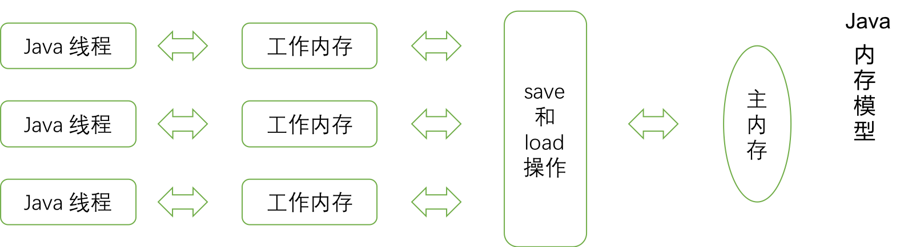

# Java 知识点随笔

# Java 可见性、有序性、原子性

```
Java 中所有的变量都是存在主内存中的
各自的线程在工作的时候会自己拿到一块工作内存，里面保存了该线程用到的变量的副本
线程对变量的操作，都是对自己工作内存中的变量操作，不能操作主内存
最终工作内存的数据是需要同步回主内存，来完成主内存中变量的更新
```

# 举例
```
大哥让仨小弟进点儿货。一个联系货源、一个联系运输公司、一个联系装卸工。
小弟 1 区联系货源，联系好了告诉大哥，“货源联系好了”。
小弟 2 一听货源好了，就去联系运输公司，运输公司联系好了，小弟 2 还没告诉大哥呢，
小弟 3 也听大哥说货源好了，也跑出去联系运输公司。
结果来了俩运输公司。

eg：
1、小弟 2 忙活完了，应该通知大哥，他已经找到运输公司了
2、大哥知道小弟 2 出去找了，应该让小弟 3 等待

上面阐述的问题，就是我们 Java 内存模型在设计的时候，围绕的三个问题：可见性，有序性，原子性
```
- 可见性：一个线程对共享变量做了修改之后，其他的线程立即能够看到该变量的这种变化
```
Java 内存模型是通过将在工作内存中的变量修改后的值同步到主内存，在读取变量前从主内存刷新最新值到工作内存中，
以这种依赖主内存的方式来实现可见性
```

- 有序性：在本线程内观察，操作都是有序的；如果在一个线程中观察另外一个线程，所有的操作都是无序的
```
Java 内存模型保证的是，同线程内，所有的操作都是自上而下，但是多线程并行的情况下，则不能保证其操作的有序性
```

- 原子性：一个操作不能被打断，要么全部执行完毕，要么不执行
```
基本数据类型的访问都是原子性的（默认 64 位，32 位的机器对 long、double 这种占 8 个字节的基本类型是非原子性的）
而针对非原子性的数据，多线程的访问则是不安全的
```

# 解决方法
- 以上是 Java 内存模型中，单线程对于可见性、有序性、原子性作出的最基本的控制，但是并发编程的场景中，多线程的出现会导致这三个问题频频发生

- [可见性](./TestVisibility.java)
```Java
/**
 * {@link valatile}关键字：通过 volatile 关键字修饰内存中的变量，该变量在线程之间共享
 * 其实对于可见性而言，无论是普通变量还是 volatile 变量都是如此，区别在于
 * volatile 的特殊规则保证了 volatile 变量值修改后的新值立刻同步到主内存中
 * 每次使用 volatile 变量前立即从主内存中刷新，因此 volatile 保证了多线程之间的操作变量的可见性。而普通变量则不能保证这一点
 * 只是 volatile 只是对关键字进行了修饰，保证了其可见性，而对于线程的有序性和变量的原子性，volatile 没有用
 */
private static volatile int volatileCount = 0;
private static void volatileCount()
{
	for(int i = 0; i < 10; i ++)
	{
		Executors.newFixedThreadPool(3).execute(() ->
		{
			try
			{
				Thread.sleep(100);
			}
			catch(InterruptedException e)
			{
				e.printStackTrace();
			}
			System.out.println("valatile count: " + ++ valatileCount);
		});
	}
}
/**
 * 代码中的 volatile 加与不加没有什么区别
 * 因为 volatile 只能保证其变量的可见性，但是每个线程啥时候开始跑，我们根本不知道，
 * 当 A 线程访问 volatileCount = 1 时，并且开始执行时，如果 B 线程此时也访问到了。B 线程也一样会执行，
 * 虽然读取 volatileCount 时，我们都能保证他时最新的，但是我们不能保证，当 A 线程在操作时，B 线程不能进去插一脚
```

- [原子性](./TestAtomicity.java)
```Java
/**
 * 原子类 {@link java.util.concurrent.atomic}包
 * 在 Java 中，++ 操作并不是线程安全的，为了保证线程间的变量原子性，Java 引入了 {@link atomic} 包
 * 它的作用就是保证，使用的变量，一定是原子性的
 */
private static AtomicInteger atomicCount = new AtomicInteger(0);
private static void atomicCount()
{
	for(int i = 0; i < 10; i ++)
	{
		Executors.newFixedThreadPool(3).execute(() ->
		{
			try
			{
				Thread.sleep(100);
			}
			catch(InterruptedException e)
			{
				e.printStackTrace();
			}
			// atomicCount.incrementAndGet() 让其自增1，等同于 ++ 操作符
			System.out.println("atomic count : " + atomicCount.incrementAndGet());
		});
	}
}
/**
 * 我们保证了 count 变量的唯一性，它一定会自增到 10 的，其实就是缓存锁机制
 * 缓存锁是指通过锁住 CPU 缓存，在 CPU 缓存区实现共享变量的原子性操作。
 * 如果缓存在处理器的缓存中，内存区域在 Lock 操作期间被锁定，当它执行锁操作，回写主内存中。
 * 处理器不在总线锁上声明 Lock 信号，而是修改内部内存地址，并允许它的缓存一致性机制来保证操作的原子性
 * 因为缓存一致性机制会阻止同时修改被两个以上处理器缓存的内存区域数据，当其他处理器回写已被锁定的缓存行的数据时会起缓存行无效。
 * 缓存锁使用的是比较并交换策略（Compare And Swap ： CAS），CAS 操作需要输入两个数值，一个旧值（期望操作前的值）和一个新值
 * 在操作期间先比较下旧值有没有发生变化，如果没有发生变换，才交换新值，发生了变化则不交换。
 * 这就是为什么我们不能保证其有序性，但是依然能正常自增到 10
 */
```

- [有序性](./TestOrderly.java)
```Java
/**
 * {@link synchronized} 
 * 只能有一个线程执行直到执行完成后或异常，才会释放锁。
 * 所以可以保证 synchronized 代码或方法只会有一个线程执行，保证了程序的有序性
 */
private static int synchronizedCount = 0;
private static void synchronizedCount()
{
	for(int i = 0; i < 10; i ++)
	{
		Executors.newFixedThreadPool(3).execute(() ->
		{
			// 通过 synchronized 关键字来保证线程之间的有序性
            synchronized(TestOrderly.class)
            {
                System.out.println(Thread.currentThread().getName() + " synchronized count : " + ++ synchronizedCount);
            }
		});
	}
}
/**
 * 结果看上去很美好，有序，且从1到10，一个不差。
 * 但是 synchronized 能不能保证原子性和可见性？还记得单例的 DCL 写法？
 */
public class A
{
	private static volatile A a;
	private A(){}
	public static A getA()
	{
		if(null == a)
		{
			synchronized(A.class)
			{
				if(null == a)
					a = new A();
			}
		}
		return a;
	}
}
/**
 * 如果不加 volatile 会有什么问题？
 * Java 内存模型（JMM）并不限制处理器重排序，在执行 a = new A();时，并不是原子语句
 * 实际包括了三个步骤
 * 1、为对象分配内存
 * 2、初始化实例对象
 * 3、把引用 instance 指向分配的内存空间
 * 这三个步骤并不能保证按序执行，处理器会进行指令重排序优化，存在这样的情况：
 * 优化重排序后执行顺序为：1，3，2.这样在线程 1 执行 3时，a 已经不为 null 了。线程 2 此时判断 a != null 
 * 则直接返回 a 引用，但现在实例对象还没有初始化完毕，此时线程 2 使用 a 可能会造成程序崩溃
 * 所以说，synchronized 只能保证有序性，并无法保证原子性，而可见性，是依靠 Java 的内存模型来保证的
 */
```

# 参考文献
- [Java 的可见性、有序性和原子性](https://www.jianshu.com/p/7f0ffb102085)